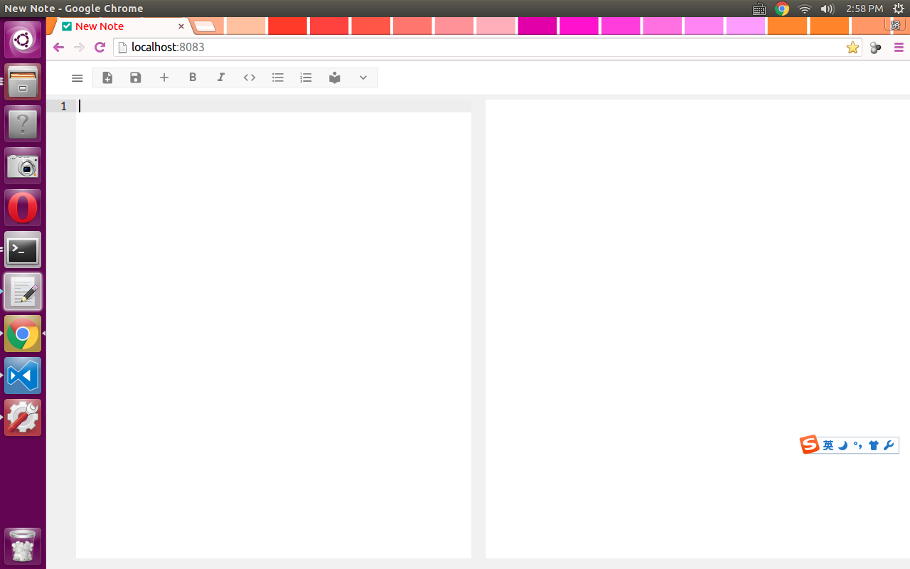
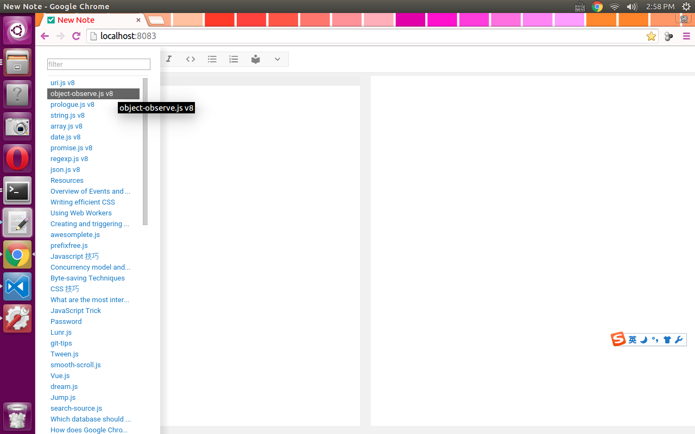
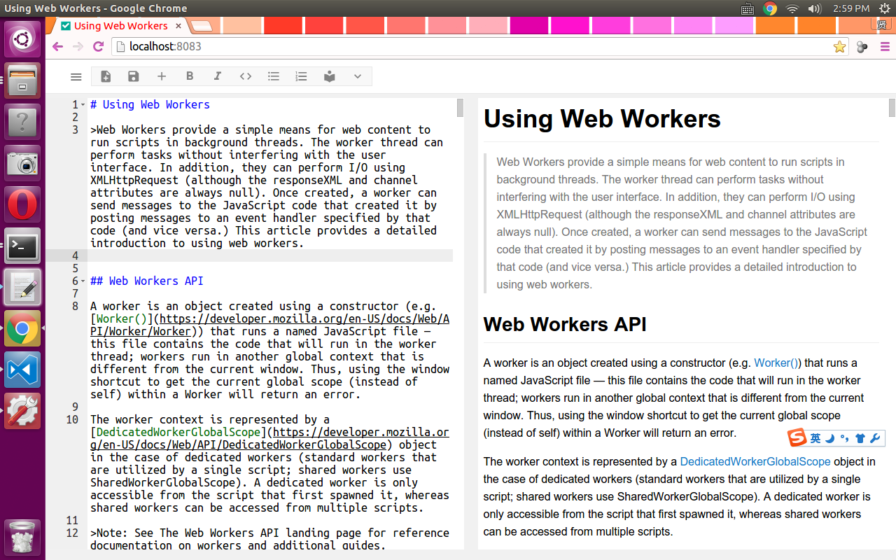

# Markdown 编辑器

一个使用 Node.js 做本地服务器的，Markdown 编辑器。

本来打算打包成跨平台的桌面程序，但调试不方便，成熟后再打包回桌面程序。所以没有兼容性的顾虑，整个程序，服务器和客户端都使用的最新的技术。

用到的新技术或者说新特性包括：

* ES6 - class,generator...几乎所有的 JavaScript 的新特性。
* HTML5 - dialog 元素
* fecth (替代了过去使用的 XMLHTTPRequest 来和服务器交换数据)

服务器使用的是 koa 框架和 sqlite，因为是笔记软件，用 sqlite 是想以后让手机程序能共享数据。

而编辑器控件用的是 ace.js, Markdown 渲染引擎是修改后的 marked.js。 

整个程序的样式文件和 JavaScript 的尽量避免使用第三方代码，再者，尽量使用了最新的技术，目的是做一次彻底的尝试的同时，制作一个自己能完全控制的笔记软件。

		